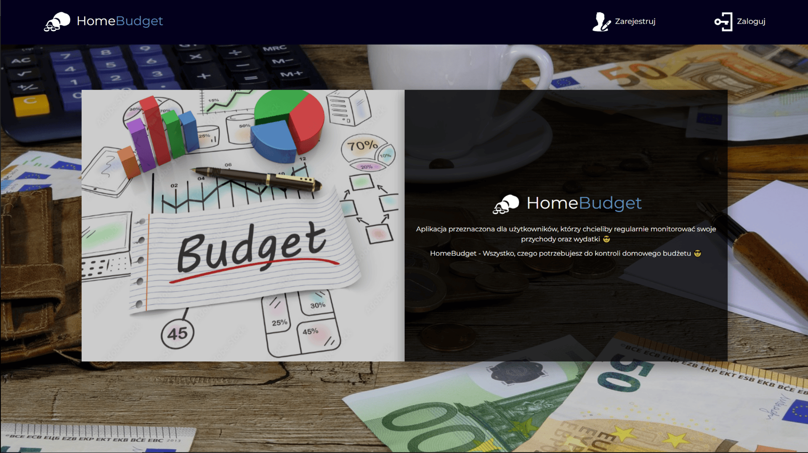

# HomeBudget

Aplikacja do zarządzania domowym budżetem

Aplikacja stworzona dla osób pragnących regularnie kontrolować zarobki i wydatki 😎. HomeBudget to zaawansowane narzędzie korzystające z różnorodnych technologii takich jak HTML, CSS (w tym elementy bootstrapa), JavaScript z użyciem AJAX oraz PHP, oparte na autorskim frameworku MVC i bazie danych MySQL.

## Wykorzystane technologie
**HTML, CSS (Bootstrap), JavaScript (AJAX), PHP (MVC framework), MySQL**

 

