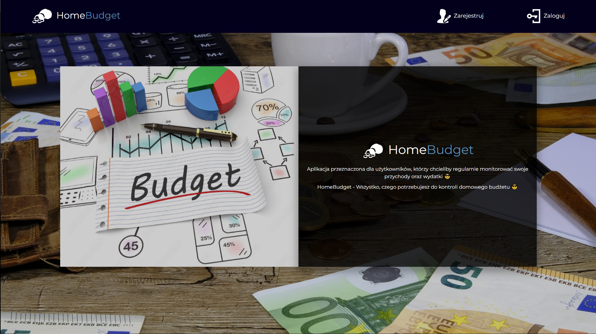
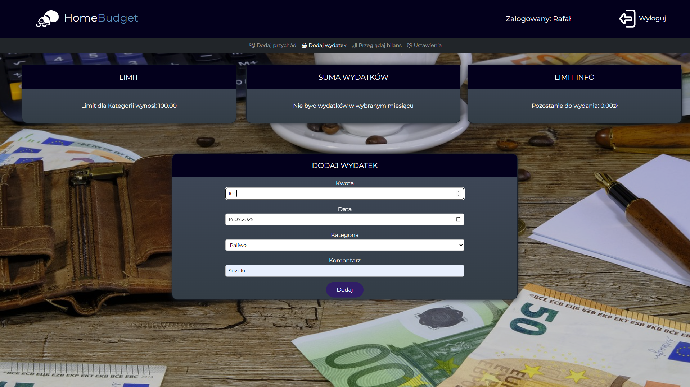
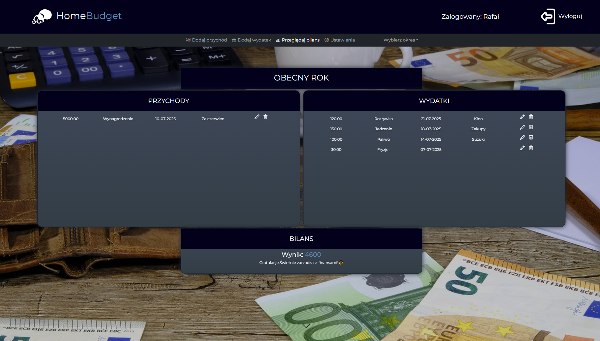

# HomeBudget

Home budget management app

HomeBudget is a web application designed for users who want to regularly track their income and expenses. It helps maintain financial control by providing clear summaries, categorization of transactions, and an easy-to-use interface.

The project is built using HTML, CSS (including Bootstrap), JavaScript with AJAX, and PHP, running on a custom lightweight MVC framework. All user data is stored securely in a MySQL database. Thanks to this technological stack, the application ensures smooth interaction, dynamic content loading, and structured server-side logic.

## Technologies used
**HTML, CSS (Bootstrap), JavaScript (AJAX), PHP (MVC framework), MySQL**

 

## Welcome Screen

After launching the application, the user is greeted with a clean and simple welcome screen that leads to the login or registration panel.
This is the starting point for accessing the home budget management system.

 

  

## Login & Registration

The application supports multiple user accounts, each with its own financial data stored in the MySQL database.
The login view allows quick access to the system, while the registration form collects only the necessary basic user information.

  

 ## Adding Incomes and Expenses

 Users can add both incomes and expenses, assigning each entry to a specific category.
Categories make it easier to analyze the structure of the budget and track financial habits over time.

  

 ## Balance View

 The balance screen provides a clear overview of the user’s financial situation for a selected time period.
The application allows choosing between:

- current month

- current year

- custom date range (from–to)

This flexibility helps users analyze their finances precisely, whether they want to check a short-term snapshot or review long-term trends.

The view is divided into two main sections:

- Incomes — all recorded earnings with amount, category, date, and optional notes

- Expenses — categorized spending entries with full edit/delete options

Each record can be edited or removed directly from the table through intuitive action icons.

  
